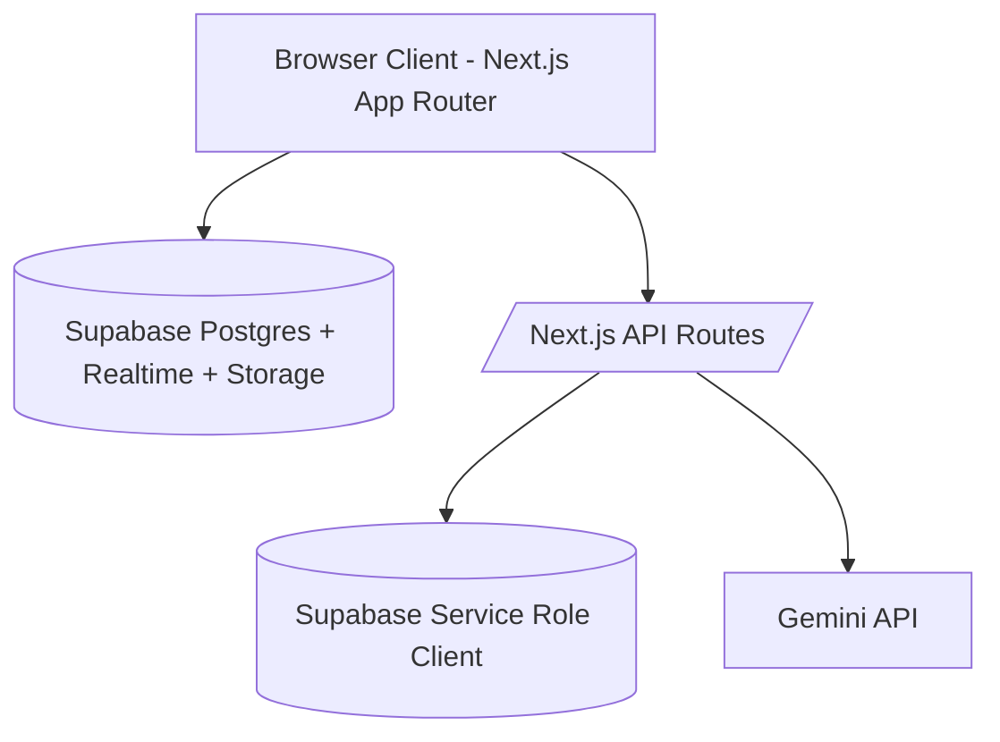

# Digital Tambayan

[](https://nextjs.org/)
[](https://react.dev/)
[](https://www.typescriptlang.org/)
[](https://supabase.com/)
[](https://tailwindcss.com/)
[](https://ai.google/)
[](package.json#L3)

Digital Tambayan is a real-time community chat app inspired by the Filipino "tambayan" concept: a shared place where people hang out, catch up, and build inside jokes.

This project is not a basic message board. It includes:

- real-time DMs and group chats
- role-aware room management (`owner`, `admin`, `member`)
- private, per-user nicknames
- profile and group photos with client-side crop and Supabase Storage upload
- a mention-triggered AI companion (`@Berto`)
- username-or-email sign-in using a server-side private lookup table
- admin dashboard for room/user/settings moderation

`package.json#version` is the single source of truth for app versioning and the footer label.

---

## Table of Contents

1. [Why this project exists](#1-why-this-project-exists)
2. [Feature deep dive](#2-feature-deep-dive)
3. [Architecture](#3-architecture)
4. [Security model](#4-security-model)
5. [Tech stack](#5-tech-stack)
6. [Prerequisites](#6-prerequisites)
7. [Local setup](#7-local-setup)
8. [Environment variables](#8-environment-variables)
9. [Database and storage setup](#9-database-and-storage-setup)
10. [Runtime scripts](#10-runtime-scripts)
11. [API routes](#11-api-routes)
12. [Realtime topology](#12-realtime-topology)
13. [Schema and RPC reference](#13-schema-and-rpc-reference)
14. [Project structure](#14-project-structure)
15. [Operational notes and deployment checklist](#15-operational-notes-and-deployment-checklist)
16. [Troubleshooting](#16-troubleshooting)
17. [Known limitations](#17-known-limitations)
18. [Versioning and changelog notes](#18-versioning-and-changelog-notes)
19. [License](#19-license)

---

## 1. Why this project exists

Most chat starter projects stop at "send and receive messages." Digital Tambayan intentionally solves the next layer of complexity:

- **Identity nuance:** each member can assign private nicknames to others in each room.
- **Moderation controls:** global admins, room admins, and room owners have separate capabilities.
- **Security hardening:** user email is removed from public profile data; username login uses private lookup and server routes.
- **Community context:** an AI bot answers with room context and the trigger user's nickname perspective.
- **Realtime consistency:** room list, members, message stream, nicknames, typing indicator, and photos all sync live.

This was a challenge in architectural parity: adapt enterprise-quality real-time chat features into a lightweight, open-source stack without sacrificing the reliability expected from bigger platforms.

---

## 2. Feature deep dive

### 2.1 Authentication and identity

- Sign-up captures `email`, `password`, and `username`.
- Sign-in accepts either email or username.
- Username sign-in calls `POST /api/auth/sign-in`, which resolves username to email using `public.lookup_email_for_username` (service-role only).
- Profile data is stored in `public.profiles` with fields: `id`, `username`, `avatar_url`, `is_admin`, `updated_at`.
- Public profile email is intentionally removed by security migration.

### 2.2 Chat modes

- **Personal chats (DMs):**
  - auto-created via user search or profile modal
  - room marked with `is_personal = true`
  - both users are equal participants (no room admin controls)
- **Group chats:**
  - created with optional name and selected members
  - role system: `owner`, `admin`, `member`
  - owner can delete the room
  - admins/owners can add/remove members and manage admin status

### 2.3 Nickname system (private perspective)

- Nicknames are scoped by:
  - room
  - target user
  - setter user
- This means nicknames are **not shared globally** and **not visible to other members** by default.
- Nickname changes sync in realtime via `room_member_nicknames` subscriptions.
- Nicknames are used in:
  - chat message display
  - personal chat display names
  - AI context formatting

### 2.4 Media system (avatars and group photos)

- Custom crop UI in `ImageCropModal` with:
  - drag-to-position
  - zoom slider
  - circular preview
- Final upload pipeline:
  1. client crops to circular composition
  2. image is normalized to `200x200` JPEG
  3. file uploaded to Supabase Storage `avatars` bucket
  4. public URL saved in `profiles.avatar_url` or `rooms.photo_url`
- Photo updates propagate in realtime through room/profile subscriptions.

### 2.5 Message operations

- Messages stream live from Supabase Realtime.
- UI adds temporary optimistic messages before DB confirmation.
- Admins can clear room history via `clear_room_messages` RPC.
- Users can delete their own messages from the UI if:
  - deletion is enabled in `chat_settings`
  - message age is within configured threshold (`deletion_threshold_minutes`)

### 2.6 Typing indicator

- Implemented with Realtime broadcast channel per room (`typing:{roomId}`).
- `typing_start` and `typing_stop` events are sent client-to-client.
- Idle timeout is 3 seconds to auto-clear stale typing states.

### 2.7 Unread message tracking

- Sidebar highlights unread rooms based on last message timestamp.
- Read state is persisted in localStorage as `chat_last_read`.
- Own messages do not mark a room as unread.

### 2.8 AI companion: Berto

- Trigger phrase: `@Berto`
- Model: `gemma-3-27b-it`
- Context window: last 10 messages
- Cooldown: 10 seconds (session-based in browser storage)
- Generation goes through secure route (`POST /api/ai/respond`) that checks:
  - bearer token validity
  - room membership
- If rate-limited or failing, the app falls back to placeholder/system-style responses.

### 2.9 Admin dashboard

- **Room Manager**
  - create rooms
  - clear room messages
  - delete group chats
- **User Manager**
  - delete users (calls secure admin API route)
  - prevents self-deletion
- **Settings Manager**
  - enable/disable message deletion
  - set deletion threshold (5 minutes to 1 week)
  - listens for realtime settings updates

---

## 3. Architecture

### 3.1 High-level system



### 3.2 Trust boundary model

- **Client-side (untrusted):**
  - uses anon key
  - reads/writes only what RLS allows
- **Server routes (trusted app logic):**
  - resolve username to email
  - verify bearer token then enforce membership/admin checks
  - call Gemini using server-side key
  - call Supabase Admin API for user deletion
- **Database (source of truth):**
  - RLS policies enforce membership and admin constraints
  - private schema stores login mapping

### 3.3 Data flow examples

- **Normal message send:** UI -> `messages` insert -> realtime fan-out -> all room members.
- **AI response:** mention detected -> context built -> `/api/ai/respond` -> Gemini -> bot message insert.
- **Username sign-in:** identifier username -> `/api/auth/sign-in` -> private lookup -> Supabase signInWithPassword -> session returned.

---

## 4. Security model

### 4.1 What is protected

- `private.user_login_emails` is not browser-readable.
- `profiles.is_admin` self-escalation is blocked by trigger.
- `rooms`, `room_members`, and `messages` are membership-scoped by RLS.
- `chat_settings` update/insert is global-admin scoped.
- privileged actions moved behind server routes:
  - username login lookup
  - Gemini proxy
  - auth user deletion

### 4.2 Important caveat

The message deletion time limit is currently enforced in the UI. Database policy allows users to delete their own messages regardless of age unless you add stricter SQL policy logic.

---

## 5. Tech stack

| Layer | Technology | Notes |
|---|---|---|
| Frontend | Next.js 16 (App Router) + React 19 | Single-page chat UX with client hooks |
| Language | TypeScript | Typed services and data contracts |
| Styling | Tailwind CSS 4 | Utility-first dark UI |
| Data/Auth | Supabase Postgres + Auth | RLS-enabled schema |
| Realtime | Supabase Realtime | Table changes + broadcast typing |
| Storage | Supabase Storage | Public avatar/group photos |
| AI | Gemini (`gemma-3-27b-it`) | Mention-triggered bot replies |

---

## 6. Prerequisites

- Node.js 18+ (Node 20+ recommended)
- npm
- Supabase project
- Gemini API key (for AI route)

---

## 7. Local setup

```bash
# 1) Install dependencies
npm install

# 2) Create local env file
# (see section 8 for exact variables)

# 3) Apply DB migrations to your Supabase project
npx supabase db push

# 4) Start dev server
npm run dev
```

Open `http://localhost:3000`.

If you are not linked to a Supabase project yet:

```bash
npx supabase login
npx supabase link --project-ref <your-project-ref>
npx supabase db push
```

---

## 8. Environment variables

Create `.env.local` in project root:

```env
NEXT_PUBLIC_SUPABASE_URL=your_supabase_project_url
NEXT_PUBLIC_SUPABASE_ANON_KEY=your_supabase_anon_key

# Server-only
SUPABASE_SERVICE_ROLE_KEY=your_service_role_key
GEMINI_API_KEY=your_gemini_api_key

# Optional fallback (not recommended)
NEXT_PUBLIC_GEMINI_API_KEY=your_gemini_api_key
```

### 8.1 Variable matrix

| Variable | Required | Scope | Used for |
|---|---|---|---|
| `NEXT_PUBLIC_SUPABASE_URL` | Yes | Client + server | Supabase client initialization |
| `NEXT_PUBLIC_SUPABASE_ANON_KEY` | Yes | Client + server | User-authenticated DB access |
| `SUPABASE_SERVICE_ROLE_KEY` | Yes (for full features) | Server only | Username lookup RPC, admin operations |
| `GEMINI_API_KEY` | Yes (for AI) | Server only | AI generation route |
| `NEXT_PUBLIC_GEMINI_API_KEY` | Optional fallback | Public | Legacy fallback if server key missing |

Without `SUPABASE_SERVICE_ROLE_KEY`, username login is unavailable and admin-only server routes fail.

---

## 9. Database and storage setup

### 9.1 Migrations in this repository

Applied in order:

1. `supabase/migrations/00000_initial_schema.sql`
2. `supabase/migrations/20260224_chat_room_improvements.sql`
3. `supabase/migrations/20260228_nickname_system.sql`
4. `supabase/migrations/20260301_finalize_photo_sync.sql`
5. `supabase/migrations/20260304_security_hardening.sql`
6. `supabase/migrations/20260304_security_hardening_followup.sql`

### 9.2 Manual storage bucket setup (required for photos)

This project expects a public `avatars` bucket.

Use Supabase SQL Editor (or migration) to set it up:

```sql
insert into storage.buckets (id, name, public)
values ('avatars', 'avatars', true)
on conflict (id) do nothing;

create policy "Avatar objects are publicly readable"
on storage.objects
for select
using (bucket_id = 'avatars');

create policy "Authenticated users can manage avatar objects"
on storage.objects
for all
to authenticated
using (bucket_id = 'avatars')
with check (bucket_id = 'avatars');
```

The policy above is intentionally broad for development convenience. Tighten it before production if needed.

### 9.3 Granting admin access to a tester account

`is_admin` is profile-driven. Promote a user manually:

```sql
update public.profiles
set is_admin = true
where username = 'your_username';
```

---

## 10. Runtime scripts

```bash
npm run dev    # start local development server
npm run build  # production build
npm run start  # run built app
npm run lint   # run ESLint
```

---

## 11. API routes

| Method | Route | Auth required | Purpose |
|---|---|---|---|
| `POST` | `/api/auth/sign-in` | No bearer token; credentials required | Sign in using email or username |
| `POST` | `/api/ai/respond` | Yes (`Authorization: Bearer <access_token>`) | Membership-validated AI response generation |
| `DELETE` | `/api/admin/users/[userId]` | Yes + requester must be global admin | Delete auth user account securely |

---

## 12. Realtime topology

Main subscription categories:

- room message stream per room
- room membership changes
- room list updates for current user
- room deletion updates
- room and profile photo updates
- nickname updates
- global chat settings updates
- typing indicator broadcast events

Representative channel names in code:

- `room:{roomId}`
- `user_rooms:{userId}`
- `user_messages:{...}`
- `user_messages_delete:{...}`
- `room_members:{roomId}`
- `room_nicknames:{roomId}:{setterUserId}`
- `typing:{roomId}`
- `chat_settings_changes`

---

## 13. Schema and RPC reference

### 13.1 Core tables (final shape)

| Table | Purpose |
|---|---|
| `public.profiles` | User profile + app role (`is_admin`) |
| `public.rooms` | Group and personal chat containers |
| `public.room_members` | Membership + room role (`owner/admin/member`) |
| `public.messages` | Chat message stream (`is_bot`, `is_system`) |
| `public.chat_settings` | Global message deletion behavior |
| `public.room_member_nicknames` | Room-scoped private nicknames |
| `private.user_login_emails` | Server-side username/email lookup |

### 13.2 Key RPC functions

| Function | Purpose |
|---|---|
| `get_user_rooms(p_user_id)` | Returns room list with metadata for sidebar |
| `get_or_create_personal_chat(p_user1_id, p_user2_id)` | Idempotent DM creation |
| `create_group_chat(p_name, p_creator_id, p_member_ids)` | Group room creation |
| `leave_room(p_room_id, p_user_id)` | Leave room with cleanup logic |
| `get_room_display_name(p_room_id, p_current_user_id)` | Computed display name with DM/nickname behavior |
| `get_room_members(room_id)` | Member list including profile fields |
| `add_room_admin(...)` / `remove_room_admin(...)` | Role promotion/demotion |
| `add_member_to_room(...)` / `remove_member_from_room(...)` | Membership changes |
| `update_room_name(...)` | Rename room |
| `clear_room_messages(p_room_id)` | Moderation clear-history operation |
| `get_member_nicknames(...)` | Fetch nicknames set by current user |
| `set_member_nickname(...)` / `delete_member_nickname(...)` | Nickname mutation |
| `lookup_email_for_username(p_username)` | Service-role-only username login lookup |
| `user_is_room_member(...)`, `user_has_room_role(...)` | Security-definer helpers for RLS |

---

## 14. Project structure

```text
src/
  app/
    api/
      admin/users/[userId]/route.ts   # admin-only auth user deletion
      ai/respond/route.ts             # secure Gemini proxy
      auth/sign-in/route.ts           # email or username sign-in
    layout.tsx                        # root layout + version footer
    page.tsx                          # auth gate / dashboard entry
  components/
    auth/                             # sign-in / sign-up form
    chat/                             # chat UI, sidebar, members panel, crop modal
    admin/                            # rooms/users/settings admin panels
    Dashboard.tsx                     # main orchestrator
  hooks/
    useChat.ts                        # message history + realtime sync
    useTypingIndicator.ts             # typing broadcast and state
  lib/
    authService.ts                    # auth client flows
    chatService.ts                    # chat + realtime + AI trigger logic
    adminService.ts                   # moderation and settings operations
    storageService.ts                 # image processing and upload
    aiService.ts                      # client wrapper for AI route
  utils/supabase/
    client.ts                         # singleton browser client
    admin.ts                          # service-role server client
supabase/
  migrations/                         # schema, RPC, RLS evolution
```

---

## 15. Operational notes and deployment checklist

Before deploying:

1. Set all required environment variables in your hosting platform.
2. Confirm all migrations are applied (`npx supabase db push`).
3. Ensure `avatars` storage bucket exists and policies are configured.
4. Create at least one admin account (`profiles.is_admin = true`).
5. Verify API routes:
   - username login works
   - AI response route validates membership
   - admin user deletion works for admin users only
6. Build and lint:
   - `npm run lint`
   - `npm run build`

---

## 16. Troubleshooting

### `Missing Supabase admin environment variables`

- Cause: `SUPABASE_SERVICE_ROLE_KEY` is missing.
- Impact: username login and admin server-side tasks fail.
- Fix: set the variable and restart the app.

### Username login returns invalid credentials even for valid users

- Cause: lookup table may not be populated or out-of-sync.
- Check: `private.user_login_emails` contains matching username/email rows.
- Fix: re-run hardening migrations and verify triggers.

### `500`/`403` on room messages or membership reads

- Cause: missing security follow-up migration or policy mismatch.
- Fix: ensure `20260304_security_hardening.sql` and `20260304_security_hardening_followup.sql` were both applied.

### Photos fail to upload or display

- Cause: missing `avatars` bucket or storage policies.
- Fix: run the SQL in section 9.2 and verify bucket is public.

### AI route returns unauthorized/forbidden

- Cause:
  - missing bearer token
  - requester not a room member
  - missing Gemini key
- Fix: ensure session exists, user belongs to room, and key is configured.

---

## 17. Known limitations

- No automated test suite is included yet.
- AI cooldown is client-session based and can be bypassed by a determined client.
- Message delete time window is UI enforced by default; DB-level time restrictions are not yet strict.
- Storage policy example is broad for simplicity and should be tightened for strict production environments.

---

## 18. Versioning and changelog notes

- Current app version: `1.0.1`
- Version source: `package.json#version`
- The layout footer renders this version at runtime via `src/lib/appMeta.ts`.

---

## 19. License

MIT
