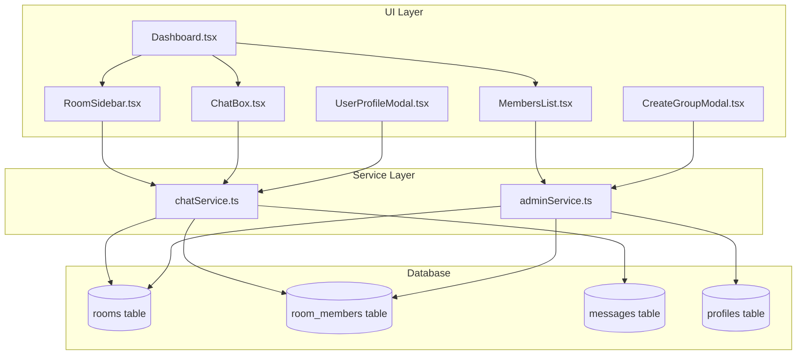

# Chat Room Improvements Plan

## Overview
This plan outlines the implementation of enhanced chat room functionality including personal chats (DMs), group chats, room sidebar, member management, and permission system.

## 1. Database Schema Changes

### 1.1 Add `is_personal` Column to `rooms` Table
```sql
ALTER TABLE public.rooms ADD COLUMN IF NOT EXISTS is_personal BOOLEAN DEFAULT FALSE;
```

### 1.2 Update `room_members` Table
The existing schema already supports roles (`owner`, `admin`, `member`). No changes needed.

### 1.3 Add `display_name` Column to `rooms` Table (Optional Override)
```sql
ALTER TABLE public.rooms ADD COLUMN IF NOT EXISTS display_name TEXT;
```

### 1.4 Create Database Functions

#### Get or Create Personal Chat
```sql
CREATE OR REPLACE FUNCTION get_or_create_personal_chat(
    p_user1_id UUID,
    p_user2_id UUID
) RETURNS UUID AS $$
DECLARE
    v_room_id UUID;
BEGIN
    -- Check if a personal chat already exists between these users
    SELECT rm1.room_id INTO v_room_id
    FROM public.room_members rm1
    INNER JOIN public.room_members rm2 ON rm1.room_id = rm2.room_id
    INNER JOIN public.rooms r ON r.id = rm1.room_id
    WHERE rm1.user_id = p_user1_id
    AND rm2.user_id = p_user2_id
    AND r.is_personal = TRUE;
    
    IF v_room_id IS NOT NULL THEN
        RETURN v_room_id;
    END IF;
    
    -- Create new personal chat room
    INSERT INTO public.rooms (slug, name, is_personal)
    VALUES (
        'personal-' || p_user1_id || '-' || p_user2_id,
        'Personal Chat',
        TRUE
    )
    RETURNING id INTO v_room_id;
    
    -- Add both users as members with equal roles
    INSERT INTO public.room_members (room_id, user_id, role)
    VALUES 
        (v_room_id, p_user1_id, 'member'),
        (v_room_id, p_user2_id, 'member');
    
    RETURN v_room_id;
END;
$$ LANGUAGE plpgsql SECURITY DEFINER;
```

#### Leave Room with Auto-Promotion and Cleanup
```sql
CREATE OR REPLACE FUNCTION leave_room(
    p_room_id UUID,
    p_user_id UUID
) RETURNS TEXT AS $$
DECLARE
    v_user_role TEXT;
    v_admin_count INT;
    v_member_count INT;
    v_oldest_member_id UUID;
    v_is_personal BOOLEAN;
BEGIN
    -- Get user's role and room type
    SELECT rm.role INTO v_user_role
    FROM public.room_members rm
    WHERE rm.room_id = p_room_id AND rm.user_id = p_user_id;
    
    SELECT is_personal INTO v_is_personal
    FROM public.rooms WHERE id = p_room_id;
    
    IF v_user_role IS NULL THEN
        RETURN 'not_a_member';
    END IF;
    
    -- Count remaining admins (excluding current user)
    SELECT COUNT(*) INTO v_admin_count
    FROM public.room_members
    WHERE room_id = p_room_id 
    AND user_id != p_user_id
    AND role IN ('owner', 'admin');
    
    -- Count remaining members
    SELECT COUNT(*) INTO v_member_count
    FROM public.room_members
    WHERE room_id = p_room_id AND user_id != p_user_id;
    
    -- If last member, delete the room
    IF v_member_count = 0 THEN
        DELETE FROM public.rooms WHERE id = p_room_id;
        RETURN 'room_deleted';
    END IF;
    
    -- If last admin, promote oldest member
    IF v_admin_count = 0 AND v_is_personal = FALSE THEN
        SELECT user_id INTO v_oldest_member_id
        FROM public.room_members
        WHERE room_id = p_room_id AND user_id != p_user_id
        ORDER BY joined_at ASC
        LIMIT 1;
        
        IF v_oldest_member_id IS NOT NULL THEN
            UPDATE public.room_members
            SET role = 'admin'
            WHERE room_id = p_room_id AND user_id = v_oldest_member_id;
        END IF;
    END IF;
    
    -- Remove the user
    DELETE FROM public.room_members
    WHERE room_id = p_room_id AND user_id = p_user_id;
    
    RETURN 'left_successfully';
END;
$$ LANGUAGE plpgsql SECURITY DEFINER;
```

#### Get User's Rooms
```sql
CREATE OR REPLACE FUNCTION get_user_rooms(
    p_user_id UUID
) RETURNS TABLE (
    id UUID,
    slug TEXT,
    name TEXT,
    is_personal BOOLEAN,
    display_name TEXT,
    role TEXT,
    last_message_at TIMESTAMPTZ,
    unread_count BIGINT
) AS $$
BEGIN
    RETURN QUERY
    SELECT 
        r.id,
        r.slug,
        r.name,
        r.is_personal,
        r.display_name,
        rm.role,
        (
            SELECT MAX(m.created_at)
            FROM public.messages m
            WHERE m.room_id = r.id
        ) as last_message_at,
        0::BIGINT as unread_count -- Placeholder for future unread implementation
    FROM public.rooms r
    INNER JOIN public.room_members rm ON r.id = rm.room_id
    WHERE rm.user_id = p_user_id
    ORDER BY 
        CASE WHEN r.is_personal THEN 0 ELSE 1 END,
        last_message_at DESC NULLS LAST;
END;
$$ LANGUAGE plpgsql SECURITY DEFINER;
```

#### Get Room Display Name
```sql
CREATE OR REPLACE FUNCTION get_room_display_name(
    p_room_id UUID,
    p_current_user_id UUID
) RETURNS TEXT AS $$
DECLARE
    v_is_personal BOOLEAN;
    v_room_name TEXT;
    v_other_username TEXT;
BEGIN
    SELECT is_personal, name INTO v_is_personal, v_room_name
    FROM public.rooms WHERE id = p_room_id;
    
    IF v_is_personal THEN
        -- For personal chats, return the other user's username
        SELECT p.username INTO v_other_username
        FROM public.room_members rm
        INNER JOIN public.profiles p ON rm.user_id = p.id
        WHERE rm.room_id = p_room_id
        AND rm.user_id != p_current_user_id
        LIMIT 1;
        
        RETURN COALESCE(v_other_username, 'Unknown User');
    ELSE
        -- For group chats, return room name or member list
        IF v_room_name IS NOT NULL AND v_room_name != '' THEN
            RETURN v_room_name;
        ELSE
            -- Return comma-separated member names
            SELECT string_agg(p.username, ', ')
            INTO v_other_username
            FROM public.room_members rm
            INNER JOIN public.profiles p ON rm.user_id = p.id
            WHERE rm.room_id = p_room_id
            LIMIT 5;
            
            RETURN COALESCE(v_other_username, 'Unnamed Group');
        END IF;
    END IF;
END;
$$ LANGUAGE plpgsql SECURITY DEFINER;
```

## 2. Type Definitions

### 2.1 Update `src/types/database.ts`

```typescript
export type Room = {
    id: string;
    slug: string;
    name: string;
    owner_id: string | null;
    is_personal: boolean;
    display_name: string | null;
    created_at: string;
};

export type RoomWithMeta = {
    id: string;
    slug: string;
    name: string;
    is_personal: boolean;
    display_name: string | null;
    role: string;
    last_message_at: string | null;
    unread_count: number;
};
```

## 3. Service Layer Changes

### 3.1 Update `src/lib/chatService.ts`

Add the following methods:

```typescript
// Get all rooms for the current user
async getUserRooms(userId: string): Promise<RoomWithMeta[]>

// Get or create personal chat with another user
async getOrCreatePersonalChat(currentUserId: string, otherUserId: string): Promise<Room>

// Create a group chat
async createGroupChat(name: string | null, memberIds: string[], creatorId: string): Promise<Room>

// Leave a room
async leaveRoom(roomId: string, userId: string): Promise<string>

// Get room display name
async getRoomDisplayName(roomId: string, currentUserId: string): Promise<string>
```

### 3.2 Update `src/lib/adminService.ts`

Add permission-based methods:

```typescript
// Check if user can add/remove members
async canManageMembers(roomId: string, userId: string): Promise<boolean>

// Check if user can add/remove admins
async canManageAdmins(roomId: string, userId: string): Promise<boolean>

// Check if user can change room name
async canChangeRoomName(roomId: string, userId: string): Promise<boolean>

// Add admin (admin only)
async addAdmin(roomId: string, userId: string, requesterId: string): Promise<void>

// Remove admin (admin only, cannot remove last admin)
async removeAdmin(roomId: string, userId: string, requesterId: string): Promise<void>

// Update room name
async updateRoomName(roomId: string, name: string, requesterId: string): Promise<void>
```

## 4. UI Components

### 4.1 New Component: `src/components/chat/RoomSidebar.tsx`

A left sidebar showing all rooms the user is a member of:

```
┌─────────────────────┐
│ 🔍 Search           │
├─────────────────────┤
│ PERSONAL CHATS      │
│ ┌─────────────────┐ │
│ │ 👤 Juan         │ │
│ │ Hey, kamusta?   │ │
│ └─────────────────┘ │
│ ┌─────────────────┐ │
│ │ 👤 Maria        │ │
│ │ See you!        │ │
│ └─────────────────┘ │
├─────────────────────┤
│ GROUP CHATS         │
│ ┌─────────────────┐ │
│ │ 👥 Barkada      │ │
│ │ Tara gala!      │ │
│ └─────────────────┘ │
│ ┌─────────────────┐ │
│ │ 👥 Work Team    │ │
│ │ Meeting at 3pm  │ │
│ └─────────────────┘ │
├─────────────────────┤
│ ➕ Create Group     │
└─────────────────────┘
```

Features:
- Search rooms
- Separate sections for personal and group chats
- Show last message preview
- Click to switch rooms
- Create group button

### 4.2 New Component: `src/components/chat/CreateGroupModal.tsx`

Modal for creating group chats:

```
┌─────────────────────────────┐
│ Create Group Chat           │
├─────────────────────────────┤
│ Group Name (optional)       │
│ ┌─────────────────────────┐ │
│ │ Barkada                 │ │
│ └─────────────────────────┘ │
│                             │
│ Select Members              │
│ ┌─────────────────────────┐ │
│ │ ☑ Juan                  │ │
│ │ ☑ Maria                 │ │
│ │ ☐ Pedro                 │ │
│ │ ☐ Ana                   │ │
│ └─────────────────────────┘ │
│                             │
│ [Cancel]  [Create Group]    │
└─────────────────────────────┘
```

### 4.3 New Component: `src/components/chat/UserProfileModal.tsx`

Modal for viewing user profile and starting personal chat:

```
┌─────────────────────────────┐
│ User Profile                │
├─────────────────────────────┤
│       👤                    │
│      Juan                   │
│                             │
│ [💬 Send Message]           │
│                             │
└─────────────────────────────┘
```

### 4.4 Update: `src/components/chat/MembersList.tsx`

Add member management features:

```
┌─────────────────────┐
│ Members         [X] │
├─────────────────────┤
│ 👤 Juan (admin)     │
│    [Remove] [Demote]│
│ 👤 Maria            │
│    [Remove] [Promote]│
│ 👤 Pedro            │
│    [Remove] [Promote]│
├─────────────────────┤
│ [+ Add Member]      │
│ [Leave Room]        │
└─────────────────────┘
```

Features:
- Show role badges
- Admin-only: Add/Remove members
- Admin-only: Promote/Demote admins
- Leave room button for all members

### 4.5 Update: `src/components/Dashboard.tsx`

Major restructure to include sidebar:

```
┌──────────────────────────────────────────────────────┐
│ Profile: Juan                          [Sign Out]    │
├────────────────┬─────────────────────────────────────┤
│                │                                     │
│  ROOM SIDEBAR  │         CHAT AREA                   │
│                │                                     │
│  Personal:     │  ● #Barkada                         │
│   - Juan       │  ┌─────────────────────────────────┐│
│   - Maria      │  │ Messages here                   ││
│                │  │                                 ││
│  Groups:       │  │                                 ││
│   - Barkada    │  └─────────────────────────────────┘│
│   - Work       │  [Type a message...] [Send]         │
│                │                                     │
│ [+ New Group]  │                                     │
└────────────────┴─────────────────────────────────────┘
```

## 5. Permission System

### 5.1 Permission Matrix

| Action | Personal Chat | Group Chat Member | Group Chat Admin |
|--------|---------------|-------------------|------------------|
| Add Member | N/A | ❌ | ✅ |
| Remove Member | N/A | ❌ | ✅ |
| Add Admin | N/A | ❌ | ✅ |
| Remove Admin | N/A | ❌ | ✅ |
| Change Room Name | ✅ (both) | ✅ | ✅ |
| Change Permissions | N/A | ❌ | ✅ |
| Leave Room | ✅ | ✅ | ✅ |

### 5.2 Special Rules

1. **Last Admin Protection**: Cannot remove/demote the last admin in a group chat
2. **Auto-Promotion**: When last admin leaves, longest-standing member becomes admin
3. **Room Deletion**: When last member leaves, room is automatically deleted
4. **Personal Chat Equality**: Both participants have equal permissions in personal chats

## 6. System Messages

### 6.1 Events that trigger system messages

- User joins room: "Juan joined the chat"
- User leaves room: "Juan left the chat"
- User is removed: "Juan was removed by Maria"
- User is promoted to admin: "Juan is now an admin"
- User is demoted from admin: "Juan is no longer an admin"
- Room name changed: "Room name changed to 'Barkada' by Juan"

## 7. Implementation Order

### Phase 1: Database & Types
1. Create new migration file with schema changes
2. Add database functions
3. Update TypeScript types

### Phase 2: Service Layer
1. Update chatService with new methods
2. Update adminService with permission methods
3. Add system message helpers

### Phase 3: UI Components
1. Create RoomSidebar component
2. Create CreateGroupModal component
3. Create UserProfileModal component
4. Update MembersList with management features
5. Restructure Dashboard layout

### Phase 4: Integration
1. Wire up all components
2. Add real-time subscriptions for room list updates
3. Test permission system
4. Test leave/join flows

## 8. Files to Modify/Create

### New Files
- `supabase/migrations/20260224_chat_room_improvements.sql`
- `src/components/chat/RoomSidebar.tsx`
- `src/components/chat/CreateGroupModal.tsx`
- `src/components/chat/UserProfileModal.tsx`

### Modified Files
- `src/types/database.ts` - Add new types
- `src/lib/chatService.ts` - Add new methods
- `src/lib/adminService.ts` - Add permission methods
- `src/components/Dashboard.tsx` - Add sidebar layout
- `src/components/chat/MembersList.tsx` - Add management features
- `CONTEXT.md` - Update session status and progress

## 9. Architecture Diagram



## 10. Key Decisions

1. **Personal chats have no admins**: Both participants have equal permissions
2. **Auto-create personal chats**: Clicking on a user profile creates/opens the chat
3. **Named vs Unnamed groups**: Groups can have optional names; if unnamed, show member list
4. **Last admin protection**: Cannot demote/remove last admin; auto-promotion on leave
5. **Room cleanup**: Empty rooms are automatically deleted
