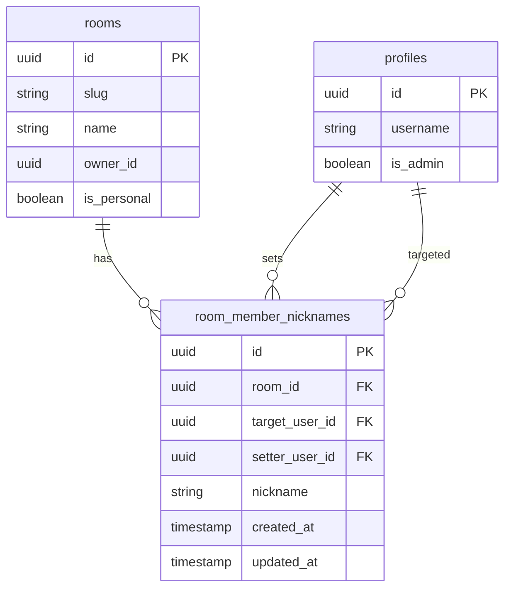

# Nickname System Implementation Plan

## Overview
Implement a per-room nickname system that allows users to set custom nicknames for other members. These nicknames are:
- **Personal to the user who sets them** (not shared with other room members)
- **Scoped to a specific room** (different rooms can have different nicknames for the same person)
- **Displayed in place of usernames** in messages and member lists

## Architecture

### Database Schema



### Key Design Decisions

1. **room_member_nicknames table**: 
   - `target_user_id`: The user being nicknamed
   - `setter_user_id`: The user who set the nickname (each user has their own view)
   - Unique constraint on (room_id, target_user_id, setter_user_id)

2. **Nickname Resolution Logic**:
   - When displaying a member: Show `nickname ?? username` (nickname if exists, else username)
   - When displaying messages: Use the setter's nickname for the sender

3. **UI Pattern**:
   - "Edit Nicknames" button in both Personal Chat Panel and Group Chat Panel
   - Opens a modal/list showing all members with their current nicknames
   - Inline editing with save/cancel buttons

## Implementation Steps

### 1. Database Migration

Create new table and functions:

```sql
-- Table: room_member_nicknames
CREATE TABLE IF NOT EXISTS public.room_member_nicknames (
    id UUID PRIMARY KEY DEFAULT gen_random_uuid(),
    room_id UUID REFERENCES public.rooms(id) ON DELETE CASCADE NOT NULL,
    target_user_id UUID REFERENCES public.profiles(id) ON DELETE CASCADE NOT NULL,
    setter_user_id UUID REFERENCES public.profiles(id) ON DELETE CASCADE NOT NULL,
    nickname TEXT NOT NULL,
    created_at TIMESTAMPTZ DEFAULT TIMEZONE('utc', NOW()) NOT NULL,
    updated_at TIMESTAMPTZ DEFAULT TIMEZONE('utc', NOW()) NOT NULL,
    UNIQUE(room_id, target_user_id, setter_user_id)
);

-- RLS Policies
ALTER TABLE public.room_member_nicknames ENABLE ROW LEVEL SECURITY;

-- Users can view their own nicknames
CREATE POLICY "Users can view nicknames they set" ON public.room_member_nicknames
    FOR SELECT USING (setter_user_id = auth.uid());

-- Users can insert/update/delete only their own nicknames
CREATE POLICY "Users can manage their own nicknames" ON public.room_member_nicknames
    FOR ALL USING (setter_user_id = auth.uid());

-- Functions
CREATE OR REPLACE FUNCTION get_member_nicknames(
    p_room_id UUID,
    p_setter_user_id UUID
) RETURNS TABLE (
    target_user_id UUID,
    nickname TEXT
) AS $$
BEGIN
    RETURN QUERY
    SELECT 
        rmn.target_user_id,
        rmn.nickname
    FROM public.room_member_nicknames rmn
    WHERE rmn.room_id = p_room_id
    AND rmn.setter_user_id = p_setter_user_id;
END;
$$ LANGUAGE plpgsql SECURITY DEFINER;

CREATE OR REPLACE FUNCTION set_member_nickname(
    p_room_id UUID,
    p_target_user_id UUID,
    p_nickname TEXT,
    p_setter_user_id UUID
) RETURNS TEXT AS $$
DECLARE
    v_is_member BOOLEAN;
BEGIN
    -- Verify setter is a member of the room
    SELECT EXISTS (
        SELECT 1 FROM public.room_members 
        WHERE room_id = p_room_id AND user_id = p_setter_user_id
    ) INTO v_is_member;
    
    IF NOT v_is_member THEN
        RETURN 'not_a_member';
    END IF;
    
    -- Verify target is also a member
    SELECT EXISTS (
        SELECT 1 FROM public.room_members 
        WHERE room_id = p_room_id AND user_id = p_target_user_id
    ) INTO v_is_member;
    
    IF NOT v_is_member THEN
        RETURN 'target_not_in_room';
    END IF;
    
    -- Insert or update
    INSERT INTO public.room_member_nicknames (room_id, target_user_id, setter_user_id, nickname)
    VALUES (p_room_id, p_target_user_id, p_setter_user_id, p_nickname)
    ON CONFLICT (room_id, target_user_id, setter_user_id)
    DO UPDATE SET nickname = p_nickname, updated_at = TIMEZONE('utc', NOW());
    
    RETURN 'success';
END;
$$ LANGUAGE plpgsql SECURITY DEFINER;

CREATE OR REPLACE FUNCTION delete_member_nickname(
    p_room_id UUID,
    p_target_user_id UUID,
    p_setter_user_id UUID
) RETURNS TEXT AS $$
BEGIN
    DELETE FROM public.room_member_nicknames
    WHERE room_id = p_room_id
    AND target_user_id = p_target_user_id
    AND setter_user_id = p_setter_user_id;
    
    IF NOT FOUND THEN
        RETURN 'nickname_not_found';
    END IF;
    
    RETURN 'success';
END;
$$ LANGUAGE plpgsql SECURITY DEFINER;
```

### 2. Type Updates

Update `src/types/database.ts`:

```typescript
export type RoomMemberNickname = {
    target_user_id: string;
    nickname: string;
};

export type RoomMemberWithUsername = {
    user_id: string;
    username: string;
    role: string;
    joined_at: string;
    is_admin: boolean;
    nickname?: string;  // Added
};
```

### 3. UI Strings

Add to `src/config/uiStrings.ts`:

```typescript
export const UI_STRINGS = {
    // ... existing strings
    nicknames: {
        editNicknames: "Edit Nicknames",
        nickname: "Nickname",
        noNickname: "No nickname set",
        setNickname: "Set nickname",
        saveNickname: "Save",
        cancel: "Cancel",
        removeNickname: "Remove nickname",
        placeholder: "Enter nickname...",
        panelTitle: "Nicknames",
    }
};
```

### 4. Service Layer Methods

Add to `src/lib/adminService.ts`:

```typescript
async getMemberNicknames(roomId: string, setterUserId: string): Promise<RoomMemberNickname[]> {
    const { data, error } = await supabase.rpc('get_member_nicknames', {
        p_room_id: roomId,
        p_setter_user_id: setterUserId
    });
    if (error) throw error;
    return data || [];
}

async setMemberNickname(
    roomId: string, 
    targetUserId: string, 
    nickname: string, 
    setterUserId: string
): Promise<string> {
    const { data, error } = await supabase.rpc('set_member_nickname', {
        p_room_id: roomId,
        p_target_user_id: targetUserId,
        p_nickname: nickname.trim(),
        p_setter_user_id: setterUserId
    });
    if (error) throw error;
    return data;
}

async deleteMemberNickname(
    roomId: string, 
    targetUserId: string, 
    setterUserId: string
): Promise<string> {
    const { data, error } = await supabase.rpc('delete_member_nickname', {
        p_room_id: roomId,
        p_target_user_id: targetUserId,
        p_setter_user_id: setterUserId
    });
    if (error) throw error;
    return data;
}
```

### 5. MembersList Component Updates

Update `src/components/chat/MembersList.tsx`:

1. **Rename headers**: Change "Personal Chat" to "Personal Chat Panel" and "Group Chat" to "Group Chat Panel"

2. **Add nickname state**:
```typescript
const [nicknames, setNicknames] = useState<Record<string, string>>({});
const [isEditingNicknames, setIsEditingNicknames] = useState(false);
const [editingNicknameFor, setEditingNicknameFor] = useState<string | null>(null);
const [nicknameInput, setNicknameInput] = useState('');
```

3. **Load nicknames**:
```typescript
const loadNicknames = useCallback(async () => {
    if (!room || !currentUserId) return;
    const data = await adminService.getMemberNicknames(room.id, currentUserId);
    const nicknameMap: Record<string, string> = {};
    data.forEach(n => {
        nicknameMap[n.target_user_id] = n.nickname;
    });
    setNicknames(nicknameMap);
}, [room, currentUserId]);
```

4. **Personal Chat Panel UI**: Replace the WIP content with:
   - Show member list with avatars and names
   - "Edit Nicknames" button
   - Clicking shows editable list of members with nickname inputs

5. **Group Chat Panel UI**: Add similar "Edit Nicknames" section

### 6. Message Display Updates

Update message display to use nicknames. The nickname should be looked up based on the current user's perspective (the setter).

Options:
- Pass nicknames map to ChatBox -> MessageItem
- Or fetch on demand in MessageItem

Recommended: Pass down from Dashboard/ChatBox to avoid extra queries.

### 7. Real-time Updates

Subscribe to nickname changes:

```typescript
subscribeToNicknames(roomId: string, setterUserId: string, onChange: () => void) {
    const channel = supabase
        .channel(`nicknames:${roomId}:${setterUserId}`)
        .on('postgres_changes', {
            event: '*',
            schema: 'public',
            table: 'room_member_nicknames',
            filter: `room_id=eq.${roomId}`
        }, () => onChange())
        .subscribe();
    return () => supabase.removeChannel(channel);
}
```

## File Changes Summary

| File | Changes |
|------|---------|
| `supabase/migrations/00000_initial_schema.sql` | Add room_member_nicknames table, policies, functions |
| `src/types/database.ts` | Add RoomMemberNickname type, update RoomMemberWithUsername |
| `src/config/uiStrings.ts` | Add nickname-related UI strings |
| `src/lib/adminService.ts` | Add getMemberNicknames, setMemberNickname, deleteMemberNickname |
| `src/lib/chatService.ts` | Add subscribeToNicknames |
| `src/components/chat/MembersList.tsx` | Rename headers, implement nickname editing UI for both panel types |
| `src/components/Dashboard.tsx` | Pass nickname data to ChatBox |
| `src/components/chat/ChatBox.tsx` | Pass nicknames to MessageItem |
| `src/components/chat/MessageItem.tsx` | Display nicknames instead of usernames |

## Migration File

The SQL migration has been created at `supabase/migrations/20260228_nickname_system.sql`

### Migration Contents:

```sql
-- ============================================================
-- 1. ROOM_MEMBER_NICKNAMES TABLE
-- ============================================================
CREATE TABLE IF NOT EXISTS public.room_member_nicknames (
    id UUID PRIMARY KEY DEFAULT gen_random_uuid(),
    room_id UUID REFERENCES public.rooms(id) ON DELETE CASCADE NOT NULL,
    target_user_id UUID REFERENCES public.profiles(id) ON DELETE CASCADE NOT NULL,
    setter_user_id UUID REFERENCES public.profiles(id) ON DELETE CASCADE NOT NULL,
    nickname TEXT NOT NULL CHECK (length(nickname) <= 50),
    created_at TIMESTAMPTZ DEFAULT TIMEZONE('utc', NOW()) NOT NULL,
    updated_at TIMESTAMPTZ DEFAULT TIMEZONE('utc', NOW()) NOT NULL,
    UNIQUE(room_id, target_user_id, setter_user_id)
);

-- Enable RLS
ALTER TABLE public.room_member_nicknames ENABLE ROW LEVEL SECURITY;

-- RLS Policies
CREATE POLICY "Users can view their own nicknames" ON public.room_member_nicknames
    FOR SELECT USING (setter_user_id = auth.uid());

CREATE POLICY "Users can insert their own nicknames" ON public.room_member_nicknames
    FOR INSERT WITH CHECK (setter_user_id = auth.uid());

CREATE POLICY "Users can update their own nicknames" ON public.room_member_nicknames
    FOR UPDATE USING (setter_user_id = auth.uid());

CREATE POLICY "Users can delete their own nicknames" ON public.room_member_nicknames
    FOR DELETE USING (setter_user_id = auth.uid());

-- ============================================================
-- 2. DATABASE FUNCTIONS
-- ============================================================

-- Function: get_member_nicknames
CREATE OR REPLACE FUNCTION get_member_nicknames(
    p_room_id UUID,
    p_setter_user_id UUID
) RETURNS TABLE (target_user_id UUID, nickname TEXT) AS $$
BEGIN
    RETURN QUERY
    SELECT rmn.target_user_id, rmn.nickname
    FROM public.room_member_nicknames rmn
    WHERE rmn.room_id = p_room_id AND rmn.setter_user_id = p_setter_user_id;
END;
$$ LANGUAGE plpgsql SECURITY DEFINER;

-- Function: set_member_nickname
CREATE OR REPLACE FUNCTION set_member_nickname(
    p_room_id UUID,
    p_target_user_id UUID,
    p_nickname TEXT,
    p_setter_user_id UUID
) RETURNS TEXT AS $$
DECLARE
    v_is_member BOOLEAN;
    v_trimmed_nickname TEXT;
BEGIN
    v_trimmed_nickname := trim(p_nickname);
    IF length(v_trimmed_nickname) = 0 THEN RETURN 'empty_nickname'; END IF;
    IF length(v_trimmed_nickname) > 50 THEN RETURN 'nickname_too_long'; END IF;

    SELECT EXISTS (
        SELECT 1 FROM public.room_members WHERE room_id = p_room_id AND user_id = p_setter_user_id
    ) INTO v_is_member;
    IF NOT v_is_member THEN RETURN 'not_a_member'; END IF;

    SELECT EXISTS (
        SELECT 1 FROM public.room_members WHERE room_id = p_room_id AND user_id = p_target_user_id
    ) INTO v_is_member;
    IF NOT v_is_member THEN RETURN 'target_not_in_room'; END IF;

    INSERT INTO public.room_member_nicknames (room_id, target_user_id, setter_user_id, nickname)
    VALUES (p_room_id, p_target_user_id, p_setter_user_id, v_trimmed_nickname)
    ON CONFLICT (room_id, target_user_id, setter_user_id)
    DO UPDATE SET nickname = v_trimmed_nickname, updated_at = TIMEZONE('utc', NOW());

    RETURN 'success';
END;
$$ LANGUAGE plpgsql SECURITY DEFINER;

-- Function: delete_member_nickname
CREATE OR REPLACE FUNCTION delete_member_nickname(
    p_room_id UUID,
    p_target_user_id UUID,
    p_setter_user_id UUID
) RETURNS TEXT AS $$
BEGIN
    DELETE FROM public.room_member_nicknames
    WHERE room_id = p_room_id AND target_user_id = p_target_user_id AND setter_user_id = p_setter_user_id;
    IF NOT FOUND THEN RETURN 'nickname_not_found'; END IF;
    RETURN 'success';
END;
$$ LANGUAGE plpgsql SECURITY DEFINER;

-- Function: get_room_members_with_nicknames (enhanced get_room_members)
CREATE OR REPLACE FUNCTION get_room_members_with_nicknames(
    p_room_id UUID,
    p_current_user_id UUID
) RETURNS TABLE (
    user_id UUID, username TEXT, role TEXT, joined_at TIMESTAMPTZ, is_admin BOOLEAN, nickname TEXT
) AS $$
BEGIN
    RETURN QUERY
    SELECT rm.user_id, p.username, rm.role, rm.joined_at, COALESCE(p.is_admin, FALSE), rmn.nickname
    FROM public.room_members rm
    LEFT JOIN public.profiles p ON rm.user_id = p.id
    LEFT JOIN public.room_member_nicknames rmn 
        ON rmn.room_id = rm.room_id 
        AND rmn.target_user_id = rm.user_id
        AND rmn.setter_user_id = p_current_user_id
    WHERE rm.room_id = p_room_id
    ORDER BY 
        CASE rm.role WHEN 'owner' THEN 1 WHEN 'admin' THEN 2 ELSE 3 END,
        rm.joined_at ASC;
END;
$$ LANGUAGE plpgsql SECURITY DEFINER;

-- ============================================================
-- 3. GRANT PERMISSIONS & REALTIME
-- ============================================================
GRANT EXECUTE ON FUNCTION get_member_nicknames(UUID, UUID) TO authenticated;
GRANT EXECUTE ON FUNCTION set_member_nickname(UUID, UUID, TEXT, UUID) TO authenticated;
GRANT EXECUTE ON FUNCTION delete_member_nickname(UUID, UUID, UUID) TO authenticated;
GRANT EXECUTE ON FUNCTION get_room_members_with_nicknames(UUID, UUID) TO authenticated;

ALTER PUBLICATION supabase_realtime ADD TABLE public.room_member_nicknames;
```

## Testing Considerations

1. **Personal Chat (1-on-1)**: Each user can independently set a nickname for the other person
2. **Group Chat**: Each member can set their own private nicknames for all other members  
3. **Empty/Deleted Nickname**: UI should immediately fall back to showing the original username
4. **Real-time Updates**: Nickname changes should reflect immediately in open panels and messages
5. **Retroactive Application**: Changing a nickname should update the display name in existing message history
6. **50 Character Limit**: Nicknames should be limited to 50 characters
7. **RLS Security**: Users should only see and manage their own nicknames, not other users' nicknames for the same person

## Notes for Implementation Mode

When switching to Code mode to implement:
1. Use the switch_mode tool to change to code mode
2. Start with database types, then UI strings, then service layer
3. The MembersList.tsx component is large (650+ lines) - make surgical edits
4. The nickname UI should be consistent between Personal and Group panels:
   - Both have an "Edit Nicknames" button
   - Both open the same modal pattern showing members list with editable nicknames
   - Default display shows username if no nickname is set
5. Remember to handle the real-time subscription cleanup properly
6. Test the nickname display in MessageItem by passing the nicknames map down from Dashboard through ChatBox
</invoke>

1. **Personal Chat**: Both users can set nicknames for each other independently
2. **Group Chat**: Each member can set their own nicknames for other members
3. **Empty nickname**: Should fall back to username
4. **Nickname removal**: Should immediately revert to username display
5. **Real-time**: Nickname changes should update in real-time across open panels
6. **Message history**: Should retroactively apply nicknames to old messages
