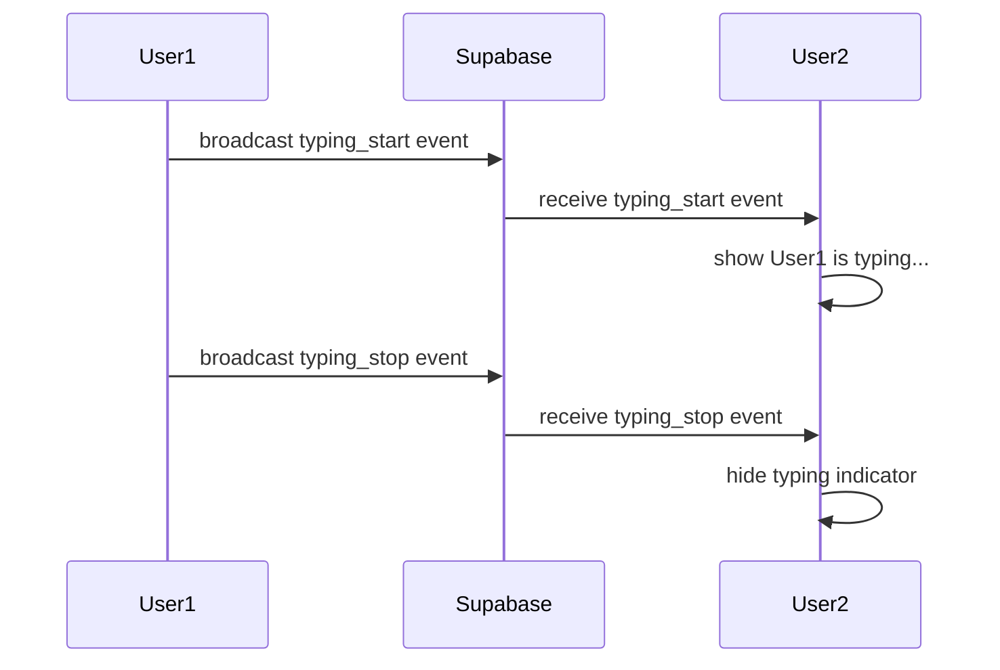

# Real-time Chat and Typing Indicators Implementation Plan

## Overview
This plan covers:
1. Fixing the chat window size to be fixed height
2. Enabling Supabase Realtime Replication for messages table
3. Implementing real-time message subscription
4. Implementing "Typing..." indicators using Supabase Broadcast

## 1. Fix Chat Window Size

### Problem
The chat container uses `min-h-[600px]` which allows it to grow. The ChatBox has `h-[400px]` but the parent container can still extend.

### Solution
- Change the Dashboard container from `min-h-[600px]` to `h-[600px]` (fixed height)
- Ensure the ChatBox properly fills the available space with overflow handling

### Files to Modify
- `src/components/Dashboard.tsx` - Change container to fixed height
- `src/components/chat/ChatBox.tsx` - Ensure proper flex layout

## 2. Enable Supabase Realtime Replication

### Problem
The messages table does not have Realtime enabled, so the subscription in `chatService.subscribeToMessages` does not receive events.

### Solution
Create a migration to enable Realtime replication for the messages table:

```sql
-- Enable Realtime for messages table
alter publication supabase_realtime add table messages;
```

### Steps
1. Create migration file `supabase/migrations/20260221_enable_realtime.sql`
2. Run the migration in Supabase dashboard

## 3. Verify Real-time Message Subscription

### Current Implementation
The `chatService.subscribeToMessages` method already uses `postgres_changes`:

```typescript
subscribeToMessages(roomId: string, callback: (message: Message) => void) {
    return supabase
        .channel(`room:${roomId}`)
        .on(
            'postgres_changes',
            {
                event: 'INSERT',
                schema: 'public',
                table: 'messages',
                filter: `room_id=eq.${roomId}`
            },
            (payload) => {
                callback(payload.new as Message)
            }
        )
        .subscribe()
}
```

### What Needs to Change
- The subscription should work once Realtime is enabled
- Need to add proper error handling and connection status logging

## 4. Implement "Typing..." Indicators

### Architecture
Using Supabase Broadcast for typing indicators:



### Implementation Steps

#### A. Create useTypingIndicator Hook
Create a new hook `src/hooks/useTypingIndicator.ts`:

```typescript
interface TypingUser {
    userId: string
    username: string
    timestamp: Date
}

export function useTypingIndicator(roomId: string, currentUserId: string, currentUsername: string) {
    // State for users currently typing
    const [typingUsers, setTypingUsers] = useState<TypingUser[]>([])
    
    // Broadcast channel
    const channel = supabase.channel(`typing:${roomId}`)
    
    // Send typing start event
    const startTyping = () => {
        channel.send({
            type: 'broadcast',
            event: 'typing_start',
            payload: { userId: currentUserId, username: currentUsername }
        })
    }
    
    // Send typing stop event
    const stopTyping = () => {
        channel.send({
            type: 'broadcast',
            event: 'typing_stop',
            payload: { userId: currentUserId }
        })
    }
    
    // Subscribe to typing events
    // Listen for typing_start and typing_stop events
    // Update typingUsers state accordingly
    
    return { typingUsers, startTyping, stopTyping }
}
```

#### B. Update ChatInput Component
Modify `src/components/chat/ChatInput.tsx`:
- Call `startTyping()` when user starts typing
- Call `stopTyping()` when user sends message or stops typing for a period

#### C. Add Typing Indicator UI
Add a component to show typing indicators:
- Display below the chat messages
- Show "X is typing..." for single user
- Show "X, Y are typing..." for multiple users

### Files to Create/Modify
1. `src/hooks/useTypingIndicator.ts` - New hook for typing functionality
2. `src/components/chat/ChatInput.tsx` - Integrate typing events
3. `src/components/chat/TypingIndicator.tsx` - New component for UI
4. `src/components/Dashboard.tsx` - Add typing indicator display

## Implementation Order

1. **Fix chat window size** - Quick CSS fix
2. **Enable Realtime** - Create and apply migration
3. **Verify real-time messages** - Test subscription works
4. **Implement typing indicators** - More complex feature

## Testing Plan

1. Open two browser windows with different users
2. Send messages from one window - should appear in the other
3. Start typing in one window - should show indicator in the other
4. Stop typing or send message - indicator should disappear
